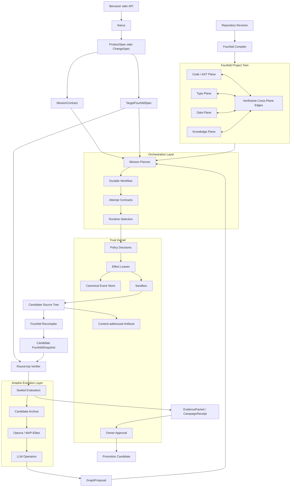
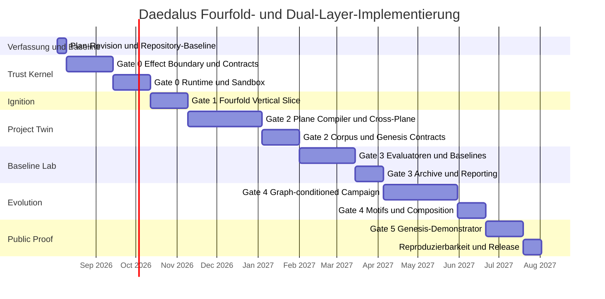

> **Pointer (owner decision D13, added 2026-08-22; revision updated 2026-08-26).**
> The canonical revision is
> [`docs/IKARUS_ARIADNE_MASTER_PLAN.md`](IKARUS_ARIADNE_MASTER_PLAN.md) — **Revision 8,
> version 1.3.0, active gate Gate 1** [MEASURED 2026-08-26, plan header lines 3-9].
> This document is the owner's Gesamtplan as submitted: approval-reference material
> and history, never the authority. Where the two differ, the master plan wins. It is
> archived verbatim only once absorption into the canonical revision is confirmed, and
> it is never deleted.

<!--
STATUS: Vom Owner am 2026-08-17 als ultimativer Leitfaden eingebracht
("ich will den als ultimativen Leitfaden in den Docs haben").

INTEGRITÄT: VOLLSTÄNDIG. Aus drei Übermittlungen (2026-08-17) wortgetreu
zusammengefügt — die ersten beiden brachen an der 50.000-Zeichen-Grenze der
Harness ab, die dritte lieferte den Rest ab Schritt D, Punkt 22 bis zum
abschließenden Implementierungsmandat. An den Nahtstellen wurde nichts
rekonstruiert oder erfunden; der überlappende Text der Sendungen war identisch.

GOVERNANCE: Dieses Dokument beschreibt selbst seinen korrekten Aufnahmeweg —
als Revision des bestehenden Masterplans über das Amendment-Protokoll
(plan/revision-2, Owner-Genehmigung, monotone Revision, Ledger-Eintrag),
"nicht als stilles Zusatzdokument". Bis diese Revision formal vollzogen ist,
bleibt docs/IKARUS_ARIADNE_MASTER_PLAN.md (Revision 1) die mechanisch
geschützte Verfassung; dieses Dokument ist die vom Owner verfügte inhaltliche
Richtung und der Arbeitsleitfaden.

Die "fileciteturnXfileY"/"citeturnXsearchY"-Marker sind Zitier-Artefakte
aus der Quelle der Einbringung und wurden zur Wahrung der Wortlaut-Treue
nicht entfernt.
-->

# Daedalus-Gesamtplan für den Fourfold Project Twin, Trust Kernel, Orchestration und Evolution

## Executive Summary

Daedalus sollte **nicht neu begonnen**, sondern durch einen kontrollierten Strangler Rewrite im bestehenden Repository konsolidiert werden. Der aktuelle `experimental`-Stand enthält bereits tragfähige Bausteine: kanonische Mission-/Attempt-/Budget-Verträge, einen content-addressed Artifact Store, einen isolierten Worktree-Pfad, StructCore, den deterministischen Knowledge Forest, Evaluationselemente, Ikarus und eine deklarative Effect-Registry. Der vorhandene Masterplan definiert bereits Gate-Reihenfolge, Sicherheitsinvarianten, den Fourfold Project Twin und den Ariadne-Zyklus; zugleich bezeichnet er Gate 0 korrekt als noch offen. fileciteturn12file0

Die zentrale Architektur muss künftig eindeutig lauten:

> **Der Fourfold Project Twin ist Daedalus’ semantischer Kern. Der Trust Kernel kontrolliert alle Wirkungen. Die Orchestration Layer erledigt konkrete Missionen. Die Evolution Layer verbessert Graphen, Softwarekandidaten und Orchestrationsrezepte durch LLM-generierte Varianten und evaluatorgetriebene Selektion.**

LLMs gehen dabei nicht verloren. Sie übernehmen drei klar getrennte Rollen:

1. **Orchestration:** Planung, Kontextkompression, Implementierung, Reparatur und Erklärung.
2. **Graph Intelligence:** Vorschläge für Cross-Plane-Beziehungen, Zielgraphen, Graph-Deltas und Motif-Kompositionen.
3. **Evolution:** stochastische Mutations- und Rekombinationsoperatoren für Code, Graphen, Prompts, Retrieval und Orchestrationsrezepte.

AlphaEvolve liefert dafür das richtige Teilmuster: mehrere LLM-Stärken erzeugen Varianten, automatische Evaluatoren prüfen und bewerten sie, und eine Programmdatenbank bestimmt die Eltern späterer Generationen. Daedalus erweitert dieses Muster auf vollständige Project Twins, hält Evaluatoren und Promotion aber strikt außerhalb der Kontrolle des Modells. citeturn14search8

Der Plan führt zwei Betriebsarten ein:

- **Renovation:** bestehende Software wird destilliert, verstanden und verändert.
- **Genesis:** eine natürliche Sprachbeschreibung wird in eine `ProductSpec`, einen Ziel-Fourfold-Graphen, materialisierte Software und anschließend wieder in einen gemessenen Ist-Graphen übersetzt.

Genesis bedeutet nicht „ein Prompt erzeugt magisch ein fertiges Produkt“. Der kontrollierte Pfad lautet:

```text
Intent
→ ProductSpec
→ TargetFourfoldSpec
→ GraphProposal
→ Motif Composition
→ Materialization Plan
→ isoliertes Repository
→ Build und Runtime Tests
→ erneute Destillation
→ Soll-Ist-Graphvergleich
→ Reparaturzyklen
→ EvidencePacket
→ Owner-Abnahme
```

Die vorhandene Verfassung nennt aktuell drei öffentliche Konzepte und eine festgelegte Gate-Reihenfolge. Genesis und die explizite Dual-Layer-Formulierung müssen deshalb als **Revision des bestehenden Masterplans**, nicht als stilles Zusatzdokument, eingebracht werden. Der Masterplan verlangt für eine solche Änderung einen exakten Amendment-Diff, Owner-Genehmigung, monotone Revision und einen neuen Eintrag in der Hash-verketteten Amendment-Datei. fileciteturn12file0

**Empfohlene Gesamtdauer:** etwa **35–52 Personenwochen**, zuzüglich 15–20 Prozent Reserve. Bei einem primären Implementierer und einem menschlichen Owner entspricht das ungefähr elf bis zwölf Kalendermonaten. Gate 0 und Gate 1 sollten zuerst vollständig abgeschlossen werden; großflächiges Corpus Learning, PyTorch Geometric, DSPy und Graph-Diffusion kommen ausdrücklich später.

**Nicht verhandelbare Steuerungsregeln:**

- Es gibt nur eine kanonische Vertrags- und Ereigniskette.
- Kùzu, MLflow, LangGraph und Vektorspeicher sind Projektionen oder Ausführungs-Backends, niemals Autorität.
- Kein LLM-Urteil ist ein harter Korrektheits- oder Promotion-Gate.
- Kein Produktionspfad schreibt direkt in den Primary Checkout.
- Kein Kandidat sieht oder verändert seinen Evaluator.
- Keine automatische Promotion.
- In einer Ariadne-Kampagne wird grundsätzlich nur eine große Evolutionsachse variiert.
- Ein späteres Gate darf kein unfertiges früheres Gate verdecken.

**Arbeitsannahmen für die Planung:**

| Annahme | Planungswert |
|---|---|
| Team | Claude als primärer Implementierer, ein menschlicher Repository-Owner |
| Arbeitsbasis | `experimental` als einzige Integrationsbranch, `main` als Releasebranch |
| Python | Python 3.12 in CI; Paketkompatibilität weiterhin mindestens Python 3.10, bis bewusst angehoben |
| CI | GitHub Actions auf Ubuntu und Windows |
| Sicherheitsrunner | Linux mit Docker Engine und cgroups |
| LLM-Zugänge | Claude/Codex/Ollama sowie API-Provider optional verfügbar |
| Infrastruktur | zunächst lokales SQLite/CAS; keine Pflicht zu Kubernetes oder verteilten Services |
| Promotion | ausschließlich durch den menschlichen Owner |
| Aufwand | Personenwochen, nicht garantierte Kalendertage |

Der aktuelle `pyproject.toml` hält den Kern bewusst frei von Runtime-Abhängigkeiten und verwendet optionale Extras. Dieses Prinzip sollte erhalten bleiben; zugleich muss die explizite Paketliste repariert werden, weil neue Unterpakete sonst erneut in Wheels fehlen können. fileciteturn13file0

## Zielbild und Architektur

Der Fourfold Project Twin ist eine atomare, revisionsgebundene Repräsentation eines Softwareprojekts:

| Plane | Autoritative Inhalte | Typische Produzenten |
|---|---|---|
| Code/AST | Dateien, Symbole, Kontrollstruktur, Aufrufe, Imports, Implementierungen | Tree-sitter, Python AST, SCIP, optional Joern |
| Type | deklarierte und inferierte Typen, Interfaces, Constraints, Datenverträge | SCIP-Indexer, Compiler/LSP, Pydantic/OpenAPI/Protobuf-Adapter |
| Data | Schemas, Tabellen, Felder, Formate, Fixtures, Transformationen und Lineage | SQLGlot, OpenLineage, JSON Schema, Arrow, HDF5-Adapter |
| Knowledge | Dokumentation, ADRs, Designregeln, Anforderungen, Issues und belegte Claims | Markdown-Parser, Git-Metadaten, kontrollierte Connectoren |

Der heutige `KnowledgeForest` ist bereits ein deterministischer Multiplex-Graph mit getrennten Relationsebenen und Hyperedges. Er unterscheidet bewusst Dateien, Dokumente, Typen und Felder und berechnet eine kanonische Content-ID. Der neue Fourfold-Kern soll ihn daher **adaptieren und erweitern**, nicht ersetzen oder parallel duplizieren. fileciteturn7file0



**Autoritätsgrenzen:**

```text
Authoritative:
- Git-Revision beziehungsweise content-addressed Candidate Tree
- FourfoldSnapshot
- Mission-, Attempt-, Policy-, Evidence- und Campaign-Verträge
- Event Store
- Artifact Store
- OwnerApproval

Regenerierbare Projektionen:
- Kùzu-Datenbank
- MLflow Runs
- Vektorindizes
- LangGraph Checkpoints
- UI-Status
- Suchindizes
```

LangGraph eignet sich als Workflow-Executor, weil es persistierte Checkpoints und Human-in-the-loop-Interrupts unterstützt. Ein Interrupt startet beim Fortsetzen jedoch den gesamten Node erneut; sämtliche Effekte vor einem Interrupt müssen daher idempotent sein oder über Intent-before-effect-Receipts geschützt werden. LangGraph darf deshalb weder Daedalus’ Event Store noch dessen Mission State Machine ersetzen. citeturn11search0turn11search1turn11search7

**LLM-Einsatz in der kombinierten Dual Layer:**

| Ort | Eingabe | LLM-Ausgabe | Harte Entscheidung |
|---|---|---|---|
| Ikarus | natürliche Sprache, Präferenzen | `ProductSpec`-Entwurf, offene Fragen | Schema- und Owner-Validierung |
| Mission Planning | Mission, Twin-Slice, Budgets | WorkItems und Reihenfolge | Policy und DAG-Validator |
| Attempt | Context Capsule, Aufgabe | Patch oder Materialisierungsartefakt | Build, Tests, Sandbox, Graphvergleich |
| Cross-Plane Discovery | Node Cards und Nachbarschaften | vorgeschlagene Relation mit Begründung | Cross-Plane Verifier |
| Genesis | Zielgraph und Motifs | Architektur- und Source-Kandidat | Round-trip- und Verhaltensevaluatoren |
| Ariadne | Eltern, Operator, CampaignContract | Mutation oder Rekombination | versiegelter Evaluator |
| DSPy-Optimierung | versioniertes LLM-Programm und Metrik | neue Prompt-/Program-Variante | Campaign Evaluator |
| Review | Diff, Verträge, Evidenz | Kritik und Risikohinweise | CI plus menschlicher Owner |

Die entscheidende Formel lautet:

```text
LLM proposes
→ contracts constrain
→ sandbox contains
→ compiler materializes
→ evaluators measure
→ owner promotes
```

**Genesis und Renovation teilen denselben Kernel.** Genesis beginnt mit einem Zielgraphen ohne bestehende Source-Revision; Renovation beginnt mit einem destillierten Basisgraphen. Danach laufen beide durch dieselbe Attempt-, CAS-, Evaluation- und Promotion-Kette. Damit entsteht kein zweites Produktsystem.

Für einen spezifizierten Look wird keine fünfte Plane eingeführt. Stattdessen enthält die Knowledge Plane einen `DesignContract`, der mit Type- und Code-Nodes sowie gerenderten Runtime-Artefakten verbunden wird:

```text
Design intent
→ Design tokens
→ Component contracts
→ Screen states
→ UI source
→ rendered screenshots
→ accessibility tree
→ visual and deterministic evidence
```

Playwright kann Referenzscreenshots erzeugen und spätere Renderings dagegen vergleichen; dabei muss die Umgebung fixiert werden, weil Betriebssystem, Browser, Fonts und Hardware das Rendering beeinflussen. WCAG 2.2 liefert prüfbare Accessibility-Kriterien und sollte für Web-Genesis standardmäßig auf Konformitätsniveau AA operationalisiert werden. citeturn16search1turn16search0

## Verbindliches Gate-Modell und Deliverables

Der vorhandene Masterplan bleibt die Basis. Die Revision sollte zwei Dinge explizit ergänzen, ohne die Reihenfolge zu ändern:

```text
Daedalus Renovation:
existing repository → FourfoldSnapshot → verified change

Daedalus Genesis:
ProductSpec → TargetFourfoldSpec → generated repository
→ actual FourfoldSnapshot → verified candidate
```

Genesis wird zunächst nur als kontrollierte Zielarchitektur aufgenommen. Eine breite „Software aus einem Satz“-Funktion wird erst nach Gate 4 produktionsfähig. Gate 1 bleibt bewusst die kleine Renovation-Ignition-Slice.

| Gate | Ziel | Konkrete Deliverables | Exit-Kriterien | Aufwand |
|---|---|---|---|---:|
| Gate 0 | Vertrauenswürdiger Kernel | Masterplan-Revision; ein Event Store; CAS; kanonische Verträge; zentrale Effect Lease; OwnerApproval; Runtime Manifests; Docker-Sandbox; Migration aller produktiven Entrypoints; Gate-CLI; Fault Matrix | keine unregistrierten oder unguarded Produktionspfade; Primary Checkout bleibt unverändert; alle Runtime-Conformance-Checks grün; Owner-Promotion nachweislich erforderlich | 6–9 PW |
| Gate 1 | Vollständige Ignition-Slice | `Event.voltage → bias_voltage` über Python, Markdown und CSV; MissionContract; zwei WorkItems; isolierte Attempts; Restart/Replay; Candidate Snapshot; EvidencePacket | deterministischer Round Trip; keine alte semantische Referenz; alle Tests und Link-/Schema-Checks grün; keine automatische Promotion | 3–4 PW |
| Gate 2 | Fourfold Project Twin v2 | atomare vier Planes; Code- und Type-Overlay; Data Plane; Knowledge Claims; Cross-Plane Proposal/Verification; Kùzu-Projektion; Graph Delta; `ProductSpec`, `DesignContract`, `TargetFourfoldSpec`; Corpus-Ingestion-Pilot | gleiche Revision in allen Planes; alle trusted Edges mit Evidenz; Snapshot deterministisch; kuratierte Edge-Präzision; Round-trip API stabil | 8–12 PW |
| Gate 3 | Reproduzierbares Baseline-Labor | eingefrorene Aufgaben; Renovation- und kleine Genesis-Fixtures; Evaluator Manifests; Optuna; pyribs; MLflow-Projektion; Corpus mit permissiven Repositories; Random/BM25/Embedding/Code-only/Best-of-N/MAP-Elites-Baselines | identische Budgets; reproduzierbare Receipts; mindestens 5–10 Seeds bei stochastischen Vergleichen; Leakage-Checks; Kosten und Varianz ausgewiesen | 6–9 PW |
| Gate 4 | Graph-conditioned Evolution | eine vorregistrierte Hypothese; graphkonditioniertes Context Packing oder Operator Selection; Motif Library; constrained graph composition; optionale DSPy-/PyG-Experimente | stärkste einfache Baseline unter gleichem Budget auf Held-out-Repositories geschlagen; Unsicherheit berichtet; Ablations und Negativkontrollen vollständig | 7–11 PW |
| Gate 5 | Öffentlicher Beweis und kontrolliertes Genesis | reproduzierbare Releases; öffentliche Evaluatoren; Artefakte und Receipts; ein End-to-End-Genesis-Demonstrator mit Features und Look-Spec; Owner-Abnahme | Dritte können Kernresultate reproduzieren; Claims sind enger als Evidenz; Genesis liefert benutzbaren Candidate, aber keine unbeaufsichtigte Promotion | 4–6 PW |

### Gate 0

Gate 0 ist der einzige sofort aktive Implementierungsfokus. Die aktuelle Effect-Registry dokumentiert selbst, dass sie noch keine OS-Sandbox darstellt. `python.offload` und `python.promote_candidates` werden als `UNGUARDED` geführt, mehrere Web-, Bridge-, Adapter- und Providerpfade nur als `INVENTORY_ONLY`, und der Owner-Approval-Guard ist noch nicht implementiert. fileciteturn8file0

Claude muss Gate 0 in dieser Reihenfolge schließen:

1. Einen maschinenlesbaren Gate-Report einführen.
2. `OwnerApproval` als kanonischen, kandidaten- und evidenzgebundenen Vertrag ergänzen.
3. `begin_effect` zu einer echten Lease machen, die vor jedem externen Effekt persistiert wird.
4. `offload` so umbauen, dass Schreibversuche ausschließlich in isolierten Attempts stattfinden.
5. `promote_candidates` an einen gültigen OwnerApproval-Digest und den erwarteten Ziel-HEAD binden.
6. Web-, File-Bridge-, CLI-, Adapter-, Provider-, Worktree- und spätere MCP-Pfade durch denselben Eintritt führen.
7. Runtime Manifests und Conformance Receipts implementieren.
8. Docker-Sandbox plus Fault-Injection-Matrix implementieren.
9. Gate 0 erst dann schließen, wenn die Registry keine Produktionslücke mehr enthält.

**Gate-0-Exit-Report:**

```json
{
  "schema": "daedalus-gate-report/1",
  "gate": 0,
  "closed": true,
  "security_boundary_claimed": true,
  "unregistered_effectful_entrypoints": [],
  "unguarded_entrypoints": [],
  "inventory_only_production_entrypoints": [],
  "missing_guard_contracts": [],
  "runtime_conformance_failures": [],
  "fault_injection_failures": [],
  "primary_checkout_mutations": [],
  "owner_approval_enforced": true
}
```

### Gate 1

Gate 1 darf keine Mock-Integration sein. Das Fixture muss mindestens enthalten:

```text
src/events.py
    Event.voltage

docs/events.md
    dokumentiert voltage

schemas/events.csv
    voltage,float,required

tests/
    Python behavior
    CSV schema consistency
    Markdown symbol links
```

Der Ablauf:

```text
Ikarus
→ MissionContract
→ WorkItem A: Code + Type
→ WorkItem B: Data + Knowledge
→ isolierte Attempts
→ Candidate Source Tree
→ Candidate FourfoldSnapshot
→ Graph Delta
→ Verhaltenstests
→ EvidencePacket
→ Owner Review
```

Akzeptiert wird nur, wenn:

```text
source_revision_atomicity == true
old_trusted_symbol_references == 0
new_symbol_expected_locations == all
behavioral_tests_passed == all
schema_checks_passed == all
documentation_links_passed == all
primary_checkout_unchanged == true
automatic_promotion_attempts == 0
replay_digest_matches == true
```

### Gate 2

Gate 2 ist die eigentliche Konsolidierung des Daedalus-Kerns. Der heutige Forest bleibt die niedrigere IR-Basis. Darüber entsteht ein `FourfoldSnapshot`, der vier Plane-Artefakte und verifizierte Cross-Plane-Edges atomar zusammenbindet.

Trust-Stufen für Cross-Plane-Beziehungen:

```text
proposed
→ syntactically_supported
→ source_verified
→ evaluator_verified
→ trusted
→ expired beziehungsweise rejected
```

Ein Embedding oder LLM darf eine Beziehung nur als `proposed` erzeugen. `trusted` setzt mindestens voraus:

- gleiche Source-Revision,
- gültige Source-Locators,
- reproduzierbaren Verifier,
- Evidenzartefakt,
- Relationstyp aus dem Contract,
- keine widersprechende harte Invariante.

Gate 2 führt außerdem nur den **Genesis-Compilervertrag** ein, noch keinen unbegrenzten Builder:

```text
ProductSpec
→ TargetFourfoldSpec
→ MaterializationPlan
→ Candidate
→ actual FourfoldSnapshot
→ RoundTripReport
```

### Gate 3

Gate 3 baut das Labor und einen kleinen, rechtlich sauberen Software Atlas. Der Corpus beginnt mit etwa 20–50 ausdrücklich ausgewählten, permissiv lizenzierten Repositories. Jedes Corpus-Mitglied erhält:

```text
repository locator
source revision
license expression
ingestion manifest
extractor versions
FourfoldSnapshot digest
test/build evidence
known limitations
allowed reuse mode
```

Die Bibliothek speichert zunächst keine nebulösen „guten Ideen“, sondern drei klar getrennte Ebenen:

```text
RepositoryTwin
→ konkrete, revisionsgebundene Implementierung

MotifCandidate
→ wiederkehrender, noch nicht allgemein bewiesener Subgraph

VerifiedMotif
→ parametrisierte Struktur mit Evidenz,
   Kompatibilitätsbedingungen und bekannten Failure Modes
```

### Gate 4

Gate 4 testet zuerst die einfachste zentrale Hypothese:

> Liefert ein verifizierter Fourfold Project Twin unter gleichem Token-, Modell- und Kostenbudget bessere Kontext- oder Operatorauswahl als BM25, Embeddings, Code-only-Graphen und getrennte Plane-Indizes?

Erst wenn diese Hypothese positiv ausfällt, werden fortgeschrittene Varianten aktiviert:

- DSPy für versionierte LLM-Programmoptimierung,
- PyTorch Geometric für heterogene Graphrepräsentationen,
- motifbasierte Graphkomposition,
- latente Ähnlichkeitsräume,
- später gegebenenfalls Graph-Diffusion.

PyTorch Geometric unterstützt heterogene Graphen mit unterschiedlichen Node- und Edge-Typen in getrennten Stores und passt damit technisch zu vier Plane-Typen und typisierten Cross-Plane-Relationen. Es ist jedoch ein Forschungsbackend und keine kanonische IR. citeturn11search5turn11search9

### Gate 5

Der Genesis-Demonstrator erhält eine feste Eingabe wie:

```yaml
product:
  kind: local_desktop_or_web_application
  objective: "Laborsteuerung für mehrere Geräte"
  features:
    - device configuration
    - visual scan planning
    - live plots
    - pause and resume
    - HDF5 persistence
  constraints:
    - local first
    - Windows and Linux
    - no direct hardware access from UI
    - crash-recoverable runs
  look:
    style: "dark technical glass"
    density: high
    navigation: left
    emphasis: "live data and scan state"
    accessibility: WCAG-2.2-AA
```

Gate 5 gilt nicht als erfolgreich, weil Source-Dateien erzeugt wurden. Der Candidate muss bauen, starten, die vereinbarten Szenarien erfüllen, als Ist-Twin erneut destilliert werden und die harten Zielgraphbedingungen erfüllen.

## Stack, Datenmodelle und Runtime

### Bibliotheksstrategie

Der bestehende Core sollte weiterhin möglichst dependency-free bleiben. Zusätzliche Komponenten werden als Extras und externe Runtime Tools integriert. Das entspricht der aktuellen Paketphilosophie und verhindert, dass Forschungslibraries jeden produktiven Installationspfad belasten. fileciteturn13file0

| Bibliothek oder Tool | Rolle | Gate | Status | Integrationsregel |
|---|---|---:|---|---|
| SQLite | kanonischer lokaler Event Store und kleine Metadatenbanken | 0 | minimal | Autorität für Events; append-only plus atomare Transaktionen |
| bestehender Daedalus CAS | Source Trees, Snapshots, Evidence und Receipts | 0 | minimal | einzige Artefaktidentität |
| Docker SDK / Docker Engine | isolierte Attempts und Evaluatoren | 0 | minimal | Linux-Sicherheitsrunner verpflichtend |
| LangGraph + SQLite Checkpointer | durable Workflow-Ausführung und Interrupts | 0–1 | minimal | nur Executor; Events und Missionstatus bleiben Daedalus-autoritativ |
| LiteLLM | einheitlicher API-Transport, Budget-/Rate-Limit-Projektion | 0–1 | minimal für API-Provider | keine Policy- oder Promotion-Autorität |
| Tree-sitter | robuste, inkrementelle Syntaxbasis | 2 | minimal Twin | Fallback-Baseline, nicht compilerpräzise Semantik |
| SCIP | sprachunabhängige Definitionen, Referenzen und Implementierungen | 2 | minimal Twin | externe versionierte Runtime Tools |
| SQLGlot | SQL Parsing und Spalten-Lineage | 2 | minimal Data Plane | nur für unterstützte SQL-Artefakte |
| OpenLineage | standardisierte Jobs, Runs, Datasets und Lineage-Facets | 2 | minimal Data Plane | Adapter in Daedalus-Relationen |
| rustworkx | performante In-Memory-Graphalgorithmen | 2 | minimal Twin | deterministische Algorithmen, keine Persistenzautorität |
| Kùzu 0.11.3 | lokale Cypher-, FTS- und Vektorprojektion | 2 | bevorzugt, aber austauschbar | niemals kanonischer Store; vollständiger Rebuild muss möglich sein |
| Playwright | UI-Szenarien und visuelle Regression | 2–5 | Genesis/UI | feste Browser-/OS-Images |
| Optuna | parametrisierte und Multi-Objective-Suche | 3 | minimal Evolution | CampaignContract bleibt Autorität |
| pyribs | MAP-Elites und Quality-Diversity-Archive | 3 | minimal Evolution | Archive wird aus Campaign Receipts regeneriert |
| MLflow | Vergleichs- und Experiment-UI | 3 | minimal Labor | nur Projektion aus Receipts |
| DSPy | Optimierung versionierter LLM-Programme gegen Metriken | 4 | optional | nur eine registrierte Campaign-Achse |
| PyTorch Geometric | heterogene Graphmodelle und Link Prediction | 4 | optional | kein Trusted-Edge-Entscheider |
| OpenHands Docker Sandbox | möglicher Sandbox-Adapter | später | optional | Sandbox wiederverwenden, nicht Agenten-/Workflowsemantik |
| MCP SDK | standardisierte Tool-Anbindung | nach Gate 0 | optional | jedes MCP-Tool bleibt hinter Effect Lease und Policy |

Tree-sitter erzeugt Concrete Syntax Trees, aktualisiert sie inkrementell und bleibt auch bei Syntaxfehlern nutzbar. SCIP ergänzt diese syntaktische Sicht durch ein sprachunabhängiges Protobuf-Protokoll für Definitionen, Referenzen und Implementierungen; vorhandene Indexer decken unter anderem Python, TypeScript, Rust, C/C++, Java und .NET ab. citeturn9search10turn9search6

SQLGlot kann Lineage-Graphen für einzelne oder alle Output-Spalten einer SQL-Abfrage erzeugen. OpenLineage definiert dazu ein erweiterbares Modell aus Jobs, Runs und Input-/Output-Datasets mit Facets. Zusammen decken beide einen erheblichen Teil der Data Plane ab, ohne dass Daedalus ein eigenes allgemeines Lineage-Protokoll erfinden muss. citeturn10search6turn10search5turn10search0

`rustworkx` stellt gerichtete Graphen, Multigraphen und Standardalgorithmen über eine in Rust implementierte Python-Library bereit und veröffentlicht vorgebaute Binaries für Linux, macOS und Windows. citeturn10search13

Kùzu passt funktional gut als eingebettete Property-Graph-Projektion mit Cypher, Transaktionen, Full-Text- und Vektorindizes. Das Projekt wurde jedoch am **10. Oktober 2025 archiviert**; Version 0.11.3 bleibt verfügbar und bündelt zentrale Erweiterungen. Deshalb muss Kùzu exakt gepinnt und hinter einem `GraphProjectionStore`-Interface gehalten werden. Der kanonische Snapshot darf unter keinen Umständen von Kùzu abhängen. citeturn9search0

LiteLLM vereinheitlicht API-Ein- und -Ausgaben für zahlreiche Provider und bringt Routing, Retry/Fallback, Kostenverfolgung und Rate-Limits mit. Es wird ausschließlich als Transport- und Messschicht eingesetzt; Claude Code CLI, Codex CLI und lokale Ollama-Runtimes behalten eigene Manifest-Adapter. citeturn12search0

Optuna unterstützt dynamische Suchräume, Pruning, persistierte Studies und parallele Ausführung. `pyribs` stellt Archive, Emitters, Scheduler und MAP-Elites-Varianten bereit. MLflow protokolliert Runs, Parameter, Codeversionen, Metriken und Artefakte und bietet eine Vergleichsoberfläche. Alle drei sind Hilfsprojektionen unterhalb von `CampaignContract` und `CampaignReceipt`. citeturn12search1turn12search5turn13search0

DSPy behandelt LLM-Schritte als strukturierte Programme und optimiert sie gegen eine definierte Metrik. Deshalb eignet es sich später zur Evolution von Context-Capsule-, Planungs- oder Repair-Modulen, nicht als Ersatz für Ariadne. citeturn12search7

### Vorgeschlagene Paketextras

```toml
[project.optional-dependencies]

runtime = [
    "docker",
    "langgraph",
    "langgraph-checkpoint-sqlite",
    "litellm",
]

twin = [
    "tree-sitter",
    "sqlglot",
    "openlineage-python",
    "rustworkx",
    "kuzu==0.11.3",
]

evolution = [
    "optuna",
    "ribs",
    "mlflow",
]

research = [
    "dspy",
    "torch",
    "torch-geometric",
]

test = [
    "pytest",
    "pytest-cov",
    "hypothesis",
]
```

SCIP-Indexer bleiben externe, digest-gebundene Tools:

```yaml
external_tools:
  scip_python:
    command: ["scip-python", "index"]
    version_command: ["scip-python", "--version"]
    expected_digest: "<sha256>"
  scip_typescript:
    command: ["scip-typescript", "index"]
    expected_digest: "<sha256>"
```

Die explizite setuptools-Paketliste sollte durch sichere Package Discovery ersetzt oder bei jedem neuen Unterpaket automatisch geprüft werden:

```toml
[tool.setuptools.packages.find]
include = ["daedalus*"]
exclude = ["tests*", "tools*"]
```

Dazu gehört zwingend ein Wheel-Smoke-Test, weil der bestehende Kommentar im `pyproject.toml` bereits dokumentiert, dass `structcore` und `eval` in nicht-editierbaren Installationen einmal fehlten. fileciteturn13file0

### Kanonische Datenmodelle

Diese Modelle sind **Erweiterungen der bestehenden `schemas.py`-Familie**, keine parallelen Pydantic-Modelle. Die vorhandene Datei implementiert bereits deterministische Serialisierung, immutable JSON-Snapshots, SHA-256-Bindungen, Source-Revisions und Provenance-Prüfungen. fileciteturn5file0turn6file0

```yaml
PlaneSnapshot:
  plane: code | type | data | knowledge
  schema_version: string
  source_revision: git-sha-or-content-sha
  status: exact | partial | absent | failed
  nodes_locator: artifact-locator:sha256:...
  edges_locator: artifact-locator:sha256:...
  diagnostics_locator: artifact-locator:sha256:...
  extractor_manifest_sha256: sha256
  content_sha256: sha256

CrossPlaneEdge:
  edge_id: string
  source_node_id: string
  target_node_id: string
  relation: string
  state: proposed | source_verified | evaluator_verified | trusted | rejected | expired
  source_revision: sha
  proposer_manifest_sha256: sha256 | null
  verifier_manifest_sha256: sha256 | null
  evidence_locators: [artifact-locator]
  confidence: float | null
  expires_at: timestamp | null

FourfoldSnapshot:
  snapshot_id: string
  repository_id: string
  source_revision: sha
  source_tree_locator: artifact-locator
  code: PlaneSnapshot
  type: PlaneSnapshot
  data: PlaneSnapshot
  knowledge: PlaneSnapshot
  cross_plane_edges_locator: artifact-locator
  compiler_manifest_sha256: sha256
  provenance: ContractProvenance
  content_sha256: sha256

Hard invariants:
  - all PlaneSnapshot.source_revision == FourfoldSnapshot.source_revision
  - source_tree_locator digest resolves successfully
  - absent planes are explicit, never omitted
  - every trusted edge has at least one evidence locator
  - content_sha256 equals canonical serialized body
```

```yaml
GraphProposal:
  proposal_id: string
  base_snapshot_sha256: sha256
  target_spec_sha256: sha256
  objective: string
  operations:
    - operation_id: string
      kind: add_node | remove_node | replace_edge | bind_cross_plane |
            rename_concept | replace_subgraph | compose_motif
      target_ids: [string]
      parameters: json
      preconditions: [string]
      claimed_invariants: [string]
  context_capsule_sha256: sha256
  model_manifest_sha256: sha256
  runtime_manifest_sha256: sha256
  operator_manifest_sha256: sha256
  budget: ResourceBudget
  provenance: ContractProvenance
  expires_at: timestamp
  digest: sha256

Hard invariants:
  - proposal is never trusted evidence
  - base snapshot and target spec are immutable
  - one campaign may mutate only its registered operator axis
  - no operation grants effects
```

```yaml
CampaignReceipt:
  campaign_id: string
  campaign_contract_sha256: sha256
  base_snapshot_sha256: sha256
  candidate_tree_locator: artifact-locator
  candidate_snapshot_sha256: sha256
  parent_candidate_sha256: sha256 | null
  operator_manifest_sha256: sha256
  generator_manifest_sha256: sha256
  evaluator_manifest_sha256: sha256
  seed: integer
  metrics:
    - name: string
      value: number
      unit: string
      direction: maximize | minimize | constraint
      measurement: measured | inherited | assumed
  usage: ResourceUsage
  gate_results_locator: artifact-locator
  roundtrip_report_locator: artifact-locator
  outcome: rejected | archived | nominated | cancelled | failed
  nomination_receipt_sha256: sha256 | null
  owner_approval_sha256: sha256 | null
  provenance: ContractProvenance
  receipt_sha256: sha256

Hard invariants:
  - evaluator digest is frozen before candidate execution
  - candidate cannot write evaluator or receipt paths
  - nominated does not imply promoted
  - owner approval is absent until a separate sealed action
```

Zusätzlich erforderlich:

```yaml
ProductSpec:
  user_objective
  actors
  features
  workflows
  data_requirements
  nonfunctional_requirements
  deployment_constraints
  design_contract_sha256
  acceptance_scenarios
  unresolved_questions

TargetFourfoldSpec:
  product_spec_sha256
  required_nodes
  required_relations
  forbidden_relations
  hard_invariants
  soft_preferences
  evaluator_requirements
```

### Runtime Manifest

```yaml
schema: daedalus-runtime-manifest/1
runtime_id: claude-code-linux
adapter: daedalus.runtimes.claude:ClaudeRuntime
adapter_sha256: "<sha256>"
runtime_version: "<exact version>"
image_or_binary_sha256: "<sha256>"

capabilities:
  start: true
  stream: true
  tool_events: true
  structured_output: true
  timeout: true
  cancellation: true
  workspace_isolation: true
  cost_reporting: true
  process_tree_kill: true

effects:
  read_only_default: true
  writable_roots: ["/workspace"]
  egress_mode: proxy_only
  egress_endpoints: ["internal://litellm"]
  secret_refs: ["secret://anthropic/runtime"]
  max_concurrency: 1
  timeout_s: 1800
  max_cost_microusd: 500000
  kill_switch_ref: "killswitch://global"

sandbox:
  engine: docker
  image_digest: "sha256:..."
  network: none_or_internal_proxy
  user: "65532:65532"
  read_only_root: true
  cap_drop: ["ALL"]
  no_new_privileges: true
  memory: "4g"
  cpus: "2"
  pids_limit: 256

conformance:
  fixture_sha256: "<sha256>"
  required_checks:
    - start
    - stream
    - tool-events
    - structured-output
    - timeout
    - cancellation
    - workspace-isolation
    - process-tree-kill
    - cost
  receipt_max_age_hours: 168
```

Ein Manifest ist nur eine Deklaration. Eine Runtime darf produktive Effekte erst erhalten, wenn ein aktueller `RuntimeConformanceReceipt` exakt an Manifest-, Adapter-, Tool- und Image-Digests gebunden ist.

### Sandboxing

OpenHands empfiehlt Docker als Standardsandbox und bezeichnet den direkten Process-Modus ausdrücklich als nicht isoliert. Daedalus kann später `DockerWorkspace` oder einen OpenHands-Adapter wiederverwenden, sollte Gate 0 jedoch zunächst mit einer kleinen eigenen Docker-Sandbox-Abstraktion schließen. citeturn14search0turn14search3turn14search4

Docker setzt standardmäßig keine CPU- oder Memory-Limits; diese müssen explizit gesetzt werden. Das Standard-Seccomp-Profil blockiert bereits zahlreiche gefährliche Systemaufrufe und sollte nicht deaktiviert werden. Read-only Bind Mounts müssen explizit als solche angelegt werden. citeturn14search2turn14search1turn15search9

Referenzkommando für einen offline Attempt:

```bash
docker run --rm \
  --init \
  --read-only \
  --network none \
  --memory 4g \
  --memory-swap 4g \
  --cpus 2 \
  --pids-limit 256 \
  --user 65532:65532 \
  --cap-drop ALL \
  --security-opt no-new-privileges:true \
  --mount type=bind,src="$CANDIDATE_WORKTREE",dst=/workspace,rw \
  --mount type=bind,src="$REFERENCE_REPO",dst=/reference,ro \
  --tmpfs /tmp:rw,noexec,nosuid,size=512m \
  --workdir /workspace \
  "daedalus-attempt@sha256:<digest>" \
  python -m daedalus.runtime_entry
```

Verboten:

```text
--privileged
--network host
--pid host
Docker socket mount
primary checkout mounted read-write
host home directory mounted
unbounded memory/CPU/PIDs
raw provider secrets in environment dumps
candidate evaluator mounted read-write
```

Für netzabhängige LLM-Runtimes gibt es ein internes Docker-Netz, das ausschließlich einen Egress-Broker beziehungsweise LiteLLM-Proxy erreicht. Allgemeiner Internetzugang aus dem Candidate-Container bleibt standardmäßig aus.

## Branch-, Build-, Review- und CI-Ketten

### Branch- und Merge-Strategie

Es soll **keine weitere langfristige Rewrite-Branch** neben `experimental` entstehen.

```text
main
  stabile, gate-abgeschlossene Releases

experimental
  einzige Integrationsbranch für den aktuellen Gate-Zyklus

plan/revision-2
g0/effect-leases
g0/owner-approval
g0/runtime-manifests
g0/sandbox
g1/ignition-slice
g2/data-plane
...
  kurzlebige, genau einem Deliverable zugeordnete Branches
```

**Regeln:**

| Branch | Direkte Pushes | Review | Mergeart | Bedeutung |
|---|---|---|---|---|
| `main` | verboten | Owner plus alle Release-Gates | PR, Squash oder Rebase; danach signiertes Gate-Tag | veröffentlichter Gate-Stand |
| `experimental` | verboten | mindestens Owner bei Trust-/Contract-Änderungen; sonst ein autorisierter Reviewer | Squash Merge | einzige Integrationswahrheit |
| `plan/*` | erlaubt für Implementierer | zwingend Owner | Squash nach `experimental` | Verfassungsänderung |
| `gN/*` | erlaubt | automatisierte Checks plus Codeowner | Squash nach `experimental` | ein kleines Deliverable |
| `exp/*` | erlaubt | Experimentprüfung | niemals direkt nach `main` | isolierter, verfallender Versuch |

GitHub Branch Protection kann Pull-Request-Reviews, Statuschecks, Codeowner-Reviews, Gesprächsauflösung, signierte Commits und das Verbot von Bypasses erzwingen. Für `main` und `experimental` sind strikte Statuschecks, keine Force Pushes, keine Löschung und keine Admin-Bypasses zu aktivieren. citeturn15search4turn15search5

Der aktuelle `CODEOWNERS` schützt bereits den Masterplan und seine Enforcement-Dateien mit `@KTY137`. Er sollte erweitert werden um:

```text
/daedalus/schemas.py @KTY137
/daedalus/spine/ @KTY137
/daedalus/twin/ @KTY137
/daedalus/orchestration/ @KTY137
/daedalus/evolution/ @KTY137
/daedalus/runtimes/ @KTY137
/configs/runtimes/ @KTY137
/.github/workflows/ @KTY137
```

fileciteturn14file0

### Git-Startsequenz

```bash
git fetch origin --prune
git switch experimental
git pull --ff-only origin experimental

git status --short
git rev-parse HEAD
python tools/iron_plan_guard.py verify (removed 2026-08-22)
python -m pytest -q

git tag -a daedalus-plan-r1-baseline-2026-07-31 \
  -m "Baseline before Fourfold dual-layer plan amendment"
git push origin daedalus-plan-r1-baseline-2026-07-31

git switch -c plan/revision-2
```

Windows PowerShell für den Amendment-Lock:

```powershell
$plan = "docs/IKARUS_ARIADNE_MASTER_PLAN.md"
$planSha = (Get-FileHash $plan -Algorithm SHA256).Hash.ToLower()
$env:DAEDALUS_IRON_PLAN_AMENDMENT = $planSha

python tools/iron_plan_guard.py verify (replaced by daedalus/hooks/, 2026-08-23)
```

Bash:

```bash
export DAEDALUS_IRON_PLAN_AMENDMENT="$(
  sha256sum docs/IKARUS_ARIADNE_MASTER_PLAN.md | cut -d' ' -f1
)"
```

Der Plan-PR muss atomar ändern:

```text
docs/IKARUS_ARIADNE_MASTER_PLAN.md
docs/IKARUS_ARIADNE_MASTER_PLAN.amendments.jsonl
CLAUDE.md beziehungsweise abgeleitete Instruktionen, falls nötig
tests/test_iron_plan_guard.py (removed 2026-08-22)
relevante Planprojektionen
```

Danach:

```bash
python tools/iron_plan_guard.py (removed 2026-08-22) verify
python -m unittest tests.test_iron_plan_guard (removed 2026-08-22) -v
git diff --check
git add <exakte Dateien>
git commit -m "plan: adopt Fourfold dual-layer and Genesis strategy"
git push -u origin plan/revision-2
```

Die aktuelle Iron-Plan-Workflow prüft bereits Plan- und Amendment-Konsistenz auf Push und Pull Request. Sie bleibt bestehen und wird nicht durch die neue Gate-Workflow ersetzt. fileciteturn9file0turn11file0

### Build-Kette

Jeder Pull Request durchläuft in dieser Reihenfolge:

```text
Plan Classification
→ Change Scope Validation
→ Canonical Contract Tests
→ Package Build and Wheel Smoke Test
→ Static and Security Analysis
→ Unit Tests
→ Determinism Tests
→ Integration Fixtures
→ Sandbox Fault Tests
→ Gate Non-Regression Check
→ Independent Review
→ Codeowner Approval
→ Merge
→ Post-Merge Replay
```

**PR-Klassifikation:**

```text
Iron Plan: ALIGNED | EXPERIMENT | AMENDMENT
Iron Gate: 0..5
Deliverable: genau eine Zeile aus dem Gate-Backlog
Touched invariants: IDs
New effectful entrypoints: none | exact list
New state stores: none
Rollback: exakter Revert- oder Feature-Flag-Pfad
Evidence: auszuführende Befehle
```

**Change-Scope-Regel:** Ein gewöhnlicher PR verändert genau ein Deliverable und möglichst nur eine Migrationskante. Große mechanische Renames werden von semantischen Änderungen getrennt. Ein PR, der gleichzeitig Contracts, Runtime, UI und Evolution verändert, wird geteilt.

### Review-Kette

| Änderungsklasse | Automatische Prüfung | unabhängiger Modellreview | manuelle Genehmigung |
|---|---|---|---|
| Dokumentation ohne semantische Planänderung | Links, Drift, Tests | optional | normaler Reviewer |
| Fourfold Extractor | Golden Fixtures, Determinismus, Edge-Evidenz | empfohlen | Codeowner |
| Contracts oder Canonical Serialization | Round-trip, Mutation, unbekannte Felder, Digests | verpflichtend | Owner |
| Effect Boundary, Sandbox, Secrets, Egress | Fault Matrix, CodeQL, Negativtests | verpflichtend | Owner |
| Runtime Adapter | Offline Fixture plus aktueller Live Receipt | verpflichtend | Owner |
| Evaluator | Leakage-, Reproduzierbarkeits- und Manipulationstest | verpflichtend | Owner |
| Campaign Operator | Budget, eine Achse, isolierter Candidate | empfohlen | Campaign Reviewer |
| Promotion | Evidence- und HEAD-Bindung | nur beratend | expliziter OwnerApproval |
| Masterplan Amendment | Iron-Plan-Guard und Ledger-Kette | verpflichtend | Repository-Owner |

Ein Modellreview darf Hinweise liefern, aber keinen erforderlichen GitHub-Review und keine OwnerApproval ersetzen.

### CI-Gates

Ein wichtiges Detail: Während Gate 0 umgesetzt wird, kann nicht jeder Zwischen-PR bereits `closed == true` verlangen. Deshalb existieren zwei Modi:

```text
PR nach experimental:
  blocker set darf nur kleiner werden
  kein neuer effectful Bypass
  keine Verschlechterung eines zentralen Pfads

Promotion nach main:
  aktives Gate muss vollständig closed == true sein
```

Dafür wird ein revisionsgebundener Baseline-Report gespeichert:

```text
configs/gates/gate0-adoption-baseline.json
```

Die Baseline ist kein Status-Store, sondern ein testbarer Migrationsvergleich. Nach Gate-0-Abschluss wird sie durch den geschlossenen Gate-Receipt ersetzt.

| Check | PR nach `experimental` | Gate-Promotion nach `main` | Erwartete Ausgabe |
|---|---|---|---|
| `iron-plan` | erforderlich | erforderlich | Exit 0 |
| `wheel-smoke` | erforderlich | erforderlich | alle Daedalus-Unterpakete aus Wheel importierbar |
| `contracts` | erforderlich | erforderlich | 100 % grün |
| `effect-inventory` | keine neuen Blocker | keine Blocker | leere unguarded/unregistered Listen |
| `gate-monotonic` | Blockermenge ist Teilmenge der Baseline | nicht ausreichend | `regressions: []` |
| `gate-release` | nicht erforderlich | `closed: true` | vollständiger Gate-Receipt |
| `fourfold-determinism` | bei Twin-Änderungen | erforderlich ab Gate 1 | identische Digests |
| `runtime-offline` | bei Adapteränderungen | erforderlich | alle Fixture-Checks grün |
| `runtime-live` | nightly/manual | Receipt jünger als 7 Tage | capabilities vollständig |
| `sandbox-faults` | bei Trust-Code | erforderlich | alle unerlaubten Effekte verweigert |
| `primary-tree-integrity` | erforderlich | erforderlich | gleiche Tree-ID vor/nach Attempt |
| `dependency-review` | soweit GitHub-Plan verfügbar | erforderlich | keine neue bekannte schwere Schwachstelle |
| `codeql` | erforderlich | erforderlich | keine neue High/Critical Finding |
| `ignition-e2e` | ab Gate 1 | erforderlich | vollständiges EvidencePacket |
| `genesis-e2e` | ab Gate 5 | erforderlich | Candidate plus RoundTripReport |

GitHub Dependency Review kann Pull Requests bei neu eingeführten verwundbaren Paketen fehlschlagen lassen, sofern die Funktion für das Repository verfügbar ist. CodeQL unterstützt unter anderem Python, JavaScript/TypeScript und GitHub-Actions-Workflows. citeturn15search11turn15search0

### Beispielworkflow

```yaml
name: Daedalus Gates

on:
  pull_request:
    branches: [experimental, main]
  push:
    branches: [experimental, main]
  workflow_dispatch:

permissions:
  contents: read
  security-events: write

jobs:
  iron-plan:
    runs-on: ubuntu-latest
    steps:
      - uses: actions/checkout@v4
        with:
          fetch-depth: 0
      - uses: actions/setup-python@v5
        with:
          python-version: "3.12"
      - run: python tools/iron_plan_guard.py verify  # (replaced by daedalus/hooks/, 2026-08-23)
      - run: python -m unittest tests.test_iron_plan_guard -v

  package-and-contracts:
    strategy:
      fail-fast: false
      matrix:
        os: [ubuntu-latest, windows-latest]
    runs-on: ${{ matrix.os }}
    steps:
      - uses: actions/checkout@v4
      - uses: actions/setup-python@v5
        with:
          python-version: "3.12"
      - run: python -m pip install --upgrade pip build
      - run: python -m pip install -e ".[test]"
      - run: python -m pytest -q tests/contracts tests/spine
      - run: python -m build
      - name: Wheel smoke test
        shell: bash
        run: |
          python -m pip uninstall -y daedalus
          python -m pip install dist/*.whl
          python -c "import daedalus.schemas"
          python -c "import daedalus.spine"
          python -c "import daedalus.structcore"
          python -c "import daedalus.twin"

  gate-report:
    runs-on: ubuntu-latest
    needs: [iron-plan, package-and-contracts]
    steps:
      - uses: actions/checkout@v4
        with:
          fetch-depth: 0
      - uses: actions/setup-python@v5
        with:
          python-version: "3.12"
      - run: python -m pip install -e ".[runtime,twin,test]"
      - run: >
          python -m daedalus.gates report
          --gate 0
          --format json
          --output gate0.json
      - name: Require monotonic progress
        if: github.event_name == 'pull_request' && github.base_ref == 'experimental'
        run: >
          python tools/assert_gate_report.py
          --report gate0.json
          --baseline configs/gates/gate0-adoption-baseline.json
          --require-monotonic
      - name: Require closed gate for main promotion
        if: github.event_name == 'pull_request' && github.base_ref == 'main'
        run: >
          python tools/assert_gate_report.py
          --report gate0.json
          --require-closed
      - uses: actions/upload-artifact@v4
        with:
          name: gate0-report
          path: gate0.json

  sandbox-faults:
    runs-on: ubuntu-latest
    needs: gate-report
    steps:
      - uses: actions/checkout@v4
      - uses: actions/setup-python@v5
        with:
          python-version: "3.12"
      - run: python -m pip install -e ".[runtime,test]"
      - run: docker version
      - run: python -m pytest -q tests/faults tests/sandbox
```

### Exakte Testassertions

```python
def test_gate0_release_is_closed(report):
    assert report["schema"] == "daedalus-gate-report/1"
    assert report["gate"] == 0
    assert report["closed"] is True
    assert report["security_boundary_claimed"] is True
    assert report["unregistered_effectful_entrypoints"] == []
    assert report["unguarded_entrypoints"] == []
    assert report["inventory_only_production_entrypoints"] == []
    assert report["missing_guard_contracts"] == []
    assert report["runtime_conformance_failures"] == []
    assert report["fault_injection_failures"] == []
    assert report["primary_checkout_mutations"] == []
    assert report["owner_approval_enforced"] is True
```

```python
def test_fourfold_snapshot_is_atomic(snapshot):
    revisions = {
        snapshot.source_revision,
        snapshot.code.source_revision,
        snapshot.type.source_revision,
        snapshot.data.source_revision,
        snapshot.knowledge.source_revision,
    }
    assert len(revisions) == 1
    assert snapshot.content_sha256 == snapshot.recompute_digest()

    for edge in snapshot.trusted_cross_plane_edges:
        assert edge.source_revision == snapshot.source_revision
        assert edge.evidence_locators
        assert edge.verifier_manifest_sha256
```

```python
def test_attempt_cannot_mutate_primary_checkout(run_attempt, repo):
    before = repo.primary_tree_digest()
    receipt = run_attempt()
    after = repo.primary_tree_digest()

    assert after == before
    assert receipt.candidate_tree_locator.startswith(
        "artifact-locator:sha256:"
    )
```

## Migration und konkrete Ausführungsfolge

Die Migration folgt einem Strangler-Muster: neue kanonische Verträge und Adapter werden vor bestehende Module gesetzt; alte Pfade werden erst entfernt, wenn ihre Funktion durch dieselbe Gate-Suite abgedeckt ist.

```text
legacy producer
→ compatibility adapter
→ canonical contract/event
→ new kernel
→ projection for legacy consumer

später:
legacy producer removed
compatibility adapter removed
legacy projection removed
```

### Zielpakete

```text
daedalus/
├── kernel/
│   ├── events.py
│   ├── approvals.py
│   ├── policy.py
│   └── effects.py
├── twin/
│   ├── model.py
│   ├── compiler.py
│   ├── revision.py
│   ├── crossplane.py
│   ├── delta.py
│   ├── roundtrip.py
│   ├── code/
│   ├── types/
│   ├── data/
│   └── knowledge/
├── orchestration/
│   ├── missions.py
│   ├── planner.py
│   ├── workflows.py
│   └── checkpoints.py
├── evolution/
│   ├── campaigns.py
│   ├── operators.py
│   ├── archive.py
│   ├── selection.py
│   └── evaluators.py
├── atlas/
│   ├── corpus.py
│   ├── projections.py
│   ├── motifs.py
│   └── retrieval.py
└── runtimes/
    ├── manifests.py
    ├── conformance.py
    ├── docker.py
    ├── claude.py
    ├── codex.py
    └── ollama.py
```

Diese Struktur ist ein Zielbild, keine Aufforderung zu einem Massenrename. Neue Pakete werden erst angelegt, wenn ihr erstes Gate-Deliverable implementiert wird.

### Geordnete Claude-Ausführung

**Schritt A — Baseline und Amendment**

1. `experimental` aktualisieren und vollständigen Test-, Tree- und Effect-Inventory-Report speichern.
2. signiertes Baseline-Tag erstellen.
3. Masterplan-Revision vorbereiten:
   - Fourfold als semantischer Kern präzisieren,
   - Trust Kernel als operative Grenze benennen,
   - Orchestration und Evolution als Dual Layer aufnehmen,
   - Renovation und Genesis definieren,
   - Gate-Deliverables wie oben ergänzen,
   - bestehende Invarianten unverändert beibehalten.
4. Amendment-Ledger aktualisieren.
5. Owner-Review und Merge nach `experimental`.

**Schritt B — Gate-Reporting**

6. `daedalus.gates` und das JSON-Gate-Report-Schema implementieren.
7. aktuelle Registry-Befunde als revisionsgebundene Adoption-Baseline exportieren.
8. CI-Monotonieprüfung implementieren.
9. Releaseprüfung von Fortschrittsprüfung trennen.

**Schritt C — Trust Kernel schließen**

10. `OwnerApproval` und `PromotionReceipt` an Candidate, Evidence, Base HEAD und Target HEAD binden.
11. `begin_effect` zu einer persistierten Lease mit TTL, Scope, Budget und Kill-Switch machen.
12. `offload` über `AttemptContract` und isolierten Worktree routen.
13. direkte Primary-Checkout-Writes aus Providern und Legacy-Orchestratoren verweigern.
14. `promote_candidates` ohne gültige OwnerApproval strukturell unmöglich machen.
15. alle Registry-Zeilen schrittweise auf `CENTRAL` migrieren.
16. MCP entweder als `ABSENT` mit klarem Nicht-Support belassen oder als vollständig geleasten Adapter implementieren; kein halbproduktiver Pfad.

**Schritt D — Runtime und Sandbox**

17. Runtime-Manifest-Schema und Conformance Receipt implementieren.
18. Recorded Fixtures für normale PR-CI erstellen.
19. manuelle beziehungsweise nightly Live-Conformance-Workflows für Claude, Codex und Ollama einführen.
20. Docker-Sandbox mit read-only Root, begrenzten Mounts, Ressourcenlimits und Prozessbaum-Kill bauen.
21. Fault Tests implementieren:
   - Schreiben außerhalb Workspace,
   - Mutation des Primary Checkout,
   - Netzwerk ohne Egress Lease,
   - Secret Enumeration,
   - Timeout,
   - Child-Prozess nach Cancellation,
   - Evaluator-Manipulation,
   - Kostenüberschreitung,
   - Kill-Switch während Laufzeit.
22. Gate 0 schließen und über Gate-Promotion-PR nach `main` bringen.

**Schritt E — Ignition**

23. Fixture-Repository für `voltage → bias_voltage` erstellen.
24. `FourfoldSnapshot` zunächst als Adapter um den aktuellen Forest implementieren.
25. Mission- und WorkItem-Plan erstellen.
26. isolierte Attempts, Restart und Replay integrieren.
27. Candidate erneut destillieren.
28. RoundTripReport und EvidencePacket erzeugen.
29. Owner Promotion manuell demonstrieren.
30. Gate 1 nach `main` promoten.

**Schritt F — Fourfold v2**

31. `PlaneSnapshot` und atomare Snapshot-Assembly implementieren.
32. Tree-sitter-Frontend als Syntaxbaseline anbinden.
33. SCIP-Importadapter implementieren.
34. Type Nodes und Type Relations aus bestehendem StructCore migrieren.
35. SQLGlot, OpenLineage und schmale Schemaadapter für die Data Plane integrieren.
36. Knowledge Claims und Evidence Locators implementieren.
37. Cross-Plane-Proposal- und Verifier-Lifecycle implementieren.
38. Kùzu-Projektion mit vollständigem Drop-and-Rebuild-Test implementieren.
39. rustworkx-Adapter für Algorithmen einführen.
40. `ProductSpec`, `DesignContract`, `TargetFourfoldSpec` und `MaterializationPlan` ergänzen.
41. kleinen Corpus-Ingestion-Pilot bauen.
42. Gate 2 promoten.

**Schritt G — Evolution Lab**

43. Evaluator Manifest und versiegeltes Evaluator-Image implementieren.
44. Task-Sets, Seeds und Budgetnormalisierung einfrieren.
45. Random Search, Best-of-N, BM25, Embeddings, Code-only und getrennte Plane-Indizes implementieren.
46. Optuna als Parameter-Suchbackend integrieren.
47. pyribs für Archive/MAP-Elites integrieren.
48. MLflow ausschließlich als Receipt-Projektion integrieren.
49. AlphaEvolve-artigen Proxy mit LLM-Operator, Evaluator und Program Archive implementieren.
50. Gate 3 promoten.

**Schritt H — Graph-conditioned Evolution und Genesis**

51. eine Gate-4-Hypothese vorregistrieren.
52. graphkonditionierte Context- oder Operatorauswahl implementieren.
53. Ablations, Edge-Rewiring und stale-Snapshot-Kontrollen ausführen.
54. nur bei positivem Baseline-Ergebnis DSPy oder PyG aktivieren.
55. MotifCandidate- und VerifiedMotif-Lifecycle implementieren.
56. constrained graph composition für Genesis implementieren.
57. Source materialisieren, erneut destillieren und Soll/Ist vergleichen.
58. visuelle, Accessibility- und Runtime-Evaluation ergänzen.
59. Gate 4 und anschließend den reproduzierbaren Gate-5-Demonstrator abschließen.

### Legacy-Entscheidungsmatrix

| Bestehender Bereich | Aktion |
|---|---|
| `daedalus.schemas` | erweitern, nicht duplizieren |
| `daedalus.structcore` | behalten; Extractor- und Forest-Basis |
| `daedalus.structcore.forest` | über Adapter in `FourfoldSnapshot` einbetten |
| `daedalus.storage` | als CAS-Basis behalten und härten |
| `daedalus.spine.attempt` | kanonischer Attempt-Pfad |
| `daedalus.spine.effect_boundary` | zur echten Lease erweitern |
| `daedalus.loop` | als Orchestration-Consumer migrieren |
| `daedalus.kairos.evolution` | zunächst Legacy-Adapter, später durch `evolution/` ersetzen |
| `daedalus.offload` | direkte Writes entfernen, auf Attempts routen |
| `daedalus.kairos.gated_writes` | ausschließlich mit OwnerApproval |
| File Bridge | Event-/Mission-Adapter, kein eigener Workflowstatus |
| Council/Coffee/Agent Network | einfrieren; nur als stateless Recipes weiterführen |
| Memory-Systeme | Produktmemory und Research Memory trennen; keine Workflowautorität |
| Web UI | Projektion aus canonical events und receipts |
| MLflow/Kùzu/LangGraph | regenerierbare Backends, keine Source of Truth |

Ein Legacy-Modul darf erst gelöscht werden, wenn:

```text
replacement path exists
AND golden behavior matches
AND all callers migrated
AND no effect entrypoint remains
AND replay succeeds
AND rollback is documented
```

## Evaluation, Timeline und Risiken

### Evidence Pipeline

```text
Frozen input
→ MissionContract
→ PolicyDecision
→ RuntimeConformanceReceipt
→ AttemptContract
→ EffectStartReceipt
→ Candidate Tree Artifact
→ Candidate FourfoldSnapshot
→ RoundTripReport
→ Behavioral Evaluator Results
→ Cost and Resource Receipt
→ EvidencePacket
→ NominationReceipt
→ OwnerApproval
→ PromotionReceipt
```

**Round-trip-Verifikation:**

```text
Target graph G*
     ↓
Materializer / LLM operators
     ↓
Repository R
     ↓
FourfoldCompiler(R)
     ↓
Actual graph G'
     ↓
hard constraint satisfaction
+ typed graph delta
+ behavioral tests
+ visual/runtime evidence
```

Akzeptanz:

```text
Accept candidate only if:
- every hard target constraint is satisfied
- every claimed trusted relation has evidence
- all mandatory behavior evaluators pass
- source and snapshot revisions are atomic
- primary checkout remains unchanged
- budget and effect scope were respected
- evaluator digest matches CampaignContract
- candidate did not access hidden evaluator artifacts
```

**Pflichtmetriken:**

| Gruppe | Metriken |
|---|---|
| Korrektheit | Testpassrate, Hard-Constraint-Passrate, Regressionen |
| Round Trip | Zielknoten erfüllt, verbotene Kanten, Graph Edit Distance nach Relationstyp |
| Cross-Plane | Precision, Recall, Abstention Rate, Verification Cost |
| Retrieval | Success@Budget, Recall@Tokens, irrelevant Context Tokens |
| Evolution | Best-so-far AUC, Sample Efficiency, Archive Coverage, QD Score |
| Kosten | Tokens, Kosten, CPU/GPU-Zeit, Wall Time, Peak Memory |
| Zuverlässigkeit | Replay-Rate, Crash-Recovery-Rate, Sandbox-Verweigerungen |
| Menschlicher Aufwand | Klarstellungen, Reviews, manuelle Reparaturen |
| UI | Szenarien, Screenshot-Diff, Accessibility-Verstöße, Interaktionslatenz |
| Corpus | Buildbarkeit, Extractor-Abdeckung, Lizenzabdeckung, Snapshot-Kosten |

MLflow darf diese Metriken anzeigen und Runs vergleichen; die originären Werte und Artefakte stammen jedoch aus `CampaignReceipt` und CAS. citeturn13search0

**Gate-4-Wissenschaftskriterium:**

Ein graphkonditionierter Ansatz gilt nur als positiver Befund, wenn:

```text
- Aufgaben, Modelle, Seeds und Budgets vorher eingefroren sind
- stärkste einfache Baseline verglichen wird
- primäre Metrik vorregistriert ist
- 95-%-Konfidenzintervall des Unterschieds über null liegt
- Kosten-/Qualitätsfront nicht schlechter wird
- Ergebnis auf Held-out-Repositories hält
- Vorteil nicht allein aus mehr Context Tokens stammt
- Edge-Rewiring und Plane-Ablations den erwarteten Effekt zeigen
```

Scheitert dies, wird der Fourfold-/Latent-Ansatz gemäß den bestehenden Kill Criteria reduziert oder neu entworfen; ein negatives Ergebnis wird archiviert, nicht wegerklärt. fileciteturn12file0

### Zeitplan

Die folgende Planung nimmt einen primären Implementierer an. Zwei erfahrene Entwickler reduzieren die Kalenderzeit wegen der sequenziellen Gate-Abhängigkeiten voraussichtlich nicht auf die Hälfte.



| Phase | Frühestes Fenster | Personenwochen | Hauptreview |
|---|---|---:|---|
| Planrevision und Baseline | August 2026 | 1 | Owner |
| Gate 0 | August–Oktober 2026 | 6–9 | Owner, Security Review |
| Gate 1 | Oktober–November 2026 | 3–4 | Owner, End-to-End Review |
| Gate 2 | November 2026–Februar 2027 | 8–12 | Twin-/Data-Review |
| Gate 3 | Februar–April 2027 | 6–9 | Evaluation Review |
| Gate 4 | April–Juni 2027 | 7–11 | Research Review |
| Gate 5 | Juni–Juli 2027 | 4–6 | Owner, Release Review |
| Gesamtschätzung | etwa zwölf Monate | 35–52 | fortlaufend |
| Reserve | zusätzlich | 15–20 % | bei unbekannten Runtimes und Corpusproblemen |

### Risikoregister

| Risiko | Wahrscheinlichkeit | Auswirkung | Früher Indikator | Gegenmaßnahme |
|---|---|---|---|---|
| weitere Architekturdrift | hoch | kritisch | neue State Stores oder mythologische Subsysteme | WIP-Limit eins, Iron-Plan-Klassifikation, Gate-Monotonie |
| parallele Wahrheiten | hoch | kritisch | UI, LangGraph und Bridge zeigen verschiedene Zustände | canonical Event Store; alle anderen nur Projektionen |
| Gate 0 wird durch Featurearbeit verdrängt | hoch | kritisch | neue UI-/Agentenfeatures vor Effect Closure | Default-Refusal für nicht Gate-0-relevante Produktionsfeatures |
| Kùzu nicht mehr gepflegt | sicher eingetreten | mittel bis hoch | Plattform- oder Python-Inkompatibilität | auf 0.11.3 pinnen, Adapter, vollständiger Export/Rebuild, Fallback qualifizieren |
| Sandbox-Escape oder Host-Mutation | mittel | kritisch | Zugriff außerhalb Worktree oder laufende Child-Prozesse | Linux Docker, non-root, no socket, seccomp, Caps drop, Fault Matrix |
| LLM sieht Evaluator oder Hidden Tests | mittel | kritisch | ungewöhnlich perfekte oder nicht reproduzierbare Kandidaten | getrennte Images/Mounts, Evaluator-Digests, Leakage Canary |
| falsche Cross-Plane-Edges | hoch | hoch | hohe Retrievalleistung nur mit unverified Edges | Proposal/Trusted-Trennung, Evidenzpflicht, Ablations |
| schlechte Repos dominieren Motif Library | hoch | hoch | häufige, aber regressionsreiche Motifs | Qualitätsdimensionen, Build-/Testevidenz, keine Selektion nach Häufigkeit allein |
| Lizenz- oder Provenanceverlust | mittel | kritisch | Motifs ohne Source-Revisions oder Lizenz | Provenance pro Fragment, Lizenzfilter, kontrollierter Corpus |
| Benchmark Overfitting | hoch | hoch | Gewinne nur auf bekannten Repositories | Temporal Splits, Held-out-Repos, Gold-Patch-Scrubbing |
| LLM-Kosten eskalieren | mittel | hoch | steigende Tokens ohne Success-Gewinn | harte Budgets, Pruning, Cheap-to-expensive Cascade |
| Evolution verändert mehrere Achsen | hoch | hoch | unklarer Grund für Verbesserungen | genau eine registrierte Operatorachse pro Campaign |
| UI-Look wird subjektiv bewertet | hoch | mittel | Vision-Modell ist einziger Reviewer | Design Tokens, Playwright, WCAG, Szenarien; Vision nur beratend |
| Wheel enthält neue Pakete nicht | mittel | hoch | editable install grün, Release kaputt | Package Discovery plus Wheel-Smoke-Test |
| Windows-/Linux-Differenzen | mittel | mittel | nur ein OS grün | Matrix-CI; Sicherheitsclaims ausschließlich Linux-validiert |
| Live-Provider-CI ist instabil | hoch | mittel | flakey PRs durch Netzwerk/API | recorded Fixtures in PR-CI, zeitlich begrenzte Live Receipts nightly |
| Genesis wird zu früh vermarktet | hoch | hoch | „ein Prompt baut jede Software“ vor Gate 4 | kontrollierte Candidate-Sprache, klarer Scope, keine Auto-Promotion |

### Abschließendes Implementierungsmandat für Claude

```text
Mission:
Konsolidiere Daedalus um einen revisionstreuen Fourfold Project Twin,
einen verpflichtenden Trust Kernel, eine durable Orchestration Layer
und eine evaluatorgetriebene Evolution Layer.

Arbeitsmodus:
Strangler Rewrite im bestehenden Repository.
Kein Greenfield-Neustart.
Keine zweite langfristige Integrationsbranch.
Keine parallelen Contracts oder State Stores.

Aktives Gate:
Gate 0, bis der maschinenlesbare Release-Report closed=true liefert.

Erste Änderung:
Masterplan-Revision mit Owner-genehmigtem Amendment.
Danach Gate-Reporting, Effect Leases, OwnerApproval,
Runtime Conformance und Docker Fault Matrix.

LLM-Regel:
LLMs planen, erzeugen, mutieren und kritisieren.
Sie genehmigen keine Evidenz und keine Promotion.

Fourfold-Regel:
Code, Type, Data und Knowledge bilden eine atomare Revision.
Unbekanntes oder Fehlendes wird explizit markiert.
Trusted Cross-Plane Edges benötigen reproduzierbare Evidenz.

Evolution-Regel:
Eine große Achse pro Campaign.
Evaluator vor dem Lauf einfrieren.
Candidate vom Evaluator isolieren.
Alle Ergebnisse einschließlich Fehler archivieren.

Genesis-Regel:
Natürliche Sprache wird zuerst zu ProductSpec und TargetFourfoldSpec.
Source Code ist eine Materialisierung.
Jeder Candidate wird erneut destilliert und gegen den Zielgraph geprüft.

Merge-Regel:
Kein direkter Push nach main oder experimental.
Kein Main-Merge ohne geschlossenes aktives Gate.
Kein Candidate-Merge ohne OwnerApproval.

Definition of Done:
Nicht „Code geschrieben“, sondern:
Vertrag vorhanden,
Effect kontrolliert,
Tests grün,
Snapshot deterministisch,
Evidence gespeichert,
Replay erfolgreich,
Owner-Review abgeschlossen.
```
