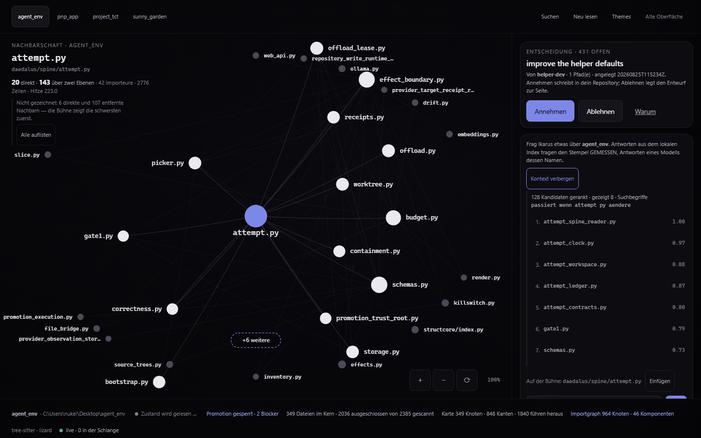

# Cockpit — 2026-08-25

**These are not mockups.** Every image in this folder is a screenshot of the
running application at `apps/web`, taken from the built bundle served by
`python -m daedalus.cli web`, against the live local API. Two per theme —
`karte-*.png` and `gespraech-*.png` — and `manifest.json` records what was on
screen for each: the theme, the composition attributes, the nodes drawn, the
module in the middle and the state line verbatim.

## What changed

The gallery round of 2026-08-24 was left as "the live decision": six designs,
pick one, throw five away. The owner asked a different question — *"können wir
ein theme editor haben mit multiple themes?"* — and this round is the answer.

Every design is now a **theme**. A theme here is not a palette: it carries the
chrome, the layout of the conversation page and how the stage draws, alongside
colour, type and material. All six are built in, all six are editable, and a
seventh does not need another design round.

**The map is its own page** (owner's call, same day: *"ich will das der Graph
eine seperate Seite erhält und lesbarer ist"*). `Karte` gives the graph the
whole canvas with nothing laid over it; `Gespräch` gives the conversation a
page where it is the hero rather than a card in a corner, with the pending
decision at the top and the map reference beside it. Labels went from 12.5px to
14.5px, the focus from 15 to 19, node radii up by half, and the budget from 14
to 18 direct neighbours — the room to be legible is what a page buys.

Two knobs were DELETED rather than left in place: `decision` (nothing floats
over the map any more, so it positioned nothing) and the `card` / `drawer`
values of `chat` (same reason). Stored themes carrying them migrate to
`column` silently. A knob that no longer moves anything is worse than no knob.

| theme | chrome | conversation page | stage |
| --- | --- | --- | --- |
| Kammer | bar | with side column | node forest, pearls |
| Werkstatt | bar | with side column | cards |
| Sternkarte | bar | with side column | star chart |
| Depesche | masthead | one centred measure | arc figure |
| Nachtfenster | bar | with side column | node forest, discs |
| Leitstand | bar | with side column | cards |

## What is real

- the map: `/api/structure` — 349 nodes, 848 edges drawn, 1840 leading off the
  map, and the surface says all three numbers.
- the conversation: `/api/ikarus/stream`, with a provenance stamp that names
  what produced the answer (the local index, or the model by name).
- the decision: `/api/drafts` — Annehmen and Ablehnen are the real apply and
  dismiss endpoints, and "Warum" fetches the draft's own report.
- the state line: `/api/health` (five states, none of which collapse into
  green), `/api/governance`, and the live event stream.

There is no fixture path in `src/cockpit/`.

## What is not drawn, and where it says so

A module with 161 importers has no readable ring. Past the layout's budget the
remainder becomes ONE glyph carrying its own count (`+66 weitere`), the header
states how many direct and how many distant neighbours were left out, and
pressing either lists exactly those modules. The stage never quietly draws 14 of
80.

## What would be read, before anything reads it

`Was würde gelesen?` next to the composer calls `/api/context/plan` with the
question you typed and shows the ranking it produced: the seeds, their scores,
the terms it actually derived from your sentence, whether the latent route was
consulted (it is off, and it says so in its own words), and the receipt digests
that tie the list to a run. That endpoint had no caller anywhere until
2026-08-25 either.

This is the distillation claim made inspectable rather than asserted. A ranked
list with the ranking removed is a list of opinions.

## The floor, measured

`apps/web/tools/audit.mjs` drives the built bundle through all six themes, BOTH
pages, at 1440 / 1280 / 900 px and reports contrast (composited through translucent
panels, SVG text included), pointer targets, the smallest rendered font size
and horizontal overflow.

**36 of 36 combinations clean** — six themes × two pages × three widths
[MEASURED 2026-08-25]: no text below 4.5:1
(3:1 for large), no HTML control under 44 px, no horizontal overflow, smallest
text exactly 11 px.

Getting there fixed real things: a type scale that produced 8.7 px `code`,
`--ink3` below the floor in three themes, Leitstand's whole palette sitting on
the chassis grey instead of the plate, and Nachtfenster's accent failing when
used as text rather than as a fill. The instrument itself had to be fixed
first — its colour parser did not understand hex, so it read white-on-black as
1.17:1.

One exception is printed on every run rather than excluded from the count: a
graph node's hit circle is 36 px, not 44, because the ring relaxes to about
32 px of spacing and a 44 px target would swallow its neighbour. The larger
equivalent path is real — ctrl+K lists every module as a 44 px row, and the
arrow keys walk the same ring.

## The test that came out of round three

`apps/web/tests/cockpit.spec.ts` is the per-project fake-data test round three
asked for: no drawn node, no palette entry and no line of the status bar may
name anything belonging to a project other than the selected one, and switching
project must CLEAR the map rather than relabel it. That last check found a real
defect on its first run, and was mutation-checked — disabling the guard turns it
red.

## Open

- Depesche's arc figure is the least finished of the six; the axis takes what
  fits at 96px per name and hands the rest to the aggregate glyph.
- `/api/capabilities`, `/api/latent/search`, `/api/events/memory`,
  `/api/accelerators/status` and the three PUT routes still have no client
  anywhere. `/api/topology` and `/api/context/plan` got theirs on 2026-08-25.
