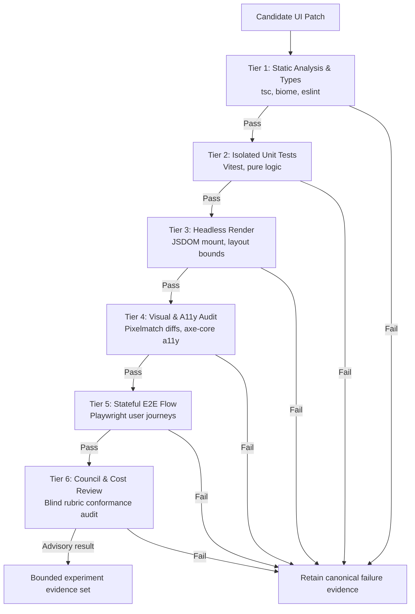

# Superagent & UI Evolution Research Proposal: OpenEvolve, Agentic-J, and Daedalus Ariadne

**Document ID:** `docs/research/SUPERAGENT_UI_EVOLUTION_ANALYSIS.md`

**Status:** Unadopted research proposal / isolated experiment hypothesis

**Provenance:** Draft synthesis; council-size and peer-review claims are not independently verified

**Date:** 2026-08-24

> This document is not architecture authority and does not amend the Ikarus/Ariadne
> master plan. The named mechanisms are hypotheses until they have bounded,
> budget-equal baselines and retained negative evidence. Any implementation must
> reuse the canonical Attempt, Artifact, Evidence, policy, and promotion paths;
> it must not introduce a second archive, evaluator authority, or promotion path.

---

## 1. Executive Summary

Autonomous user interface generation and iterative code evolution require bridging two traditionally divergent paradigms:
1. **Evolutionary Search**: Maintaining structural diversity, exploration-exploitation trade-offs, and quality-diversity archives (MAP-Elites).
2. **Deterministic Agentic Verification**: Ensuring strict containment, multi-tier evaluation cascades, and cryptographically verified candidate provenance.

This document synthesizes findings from two major reference systems:
- **OpenEvolve** (`references/openevolve/` @ SHA `411fb59c`): Open-source evolutionary coding agent (MAP-Elites, 70/20/10 sampling, multi-exemplar inspiration prompts).
- **Agentic-J** (arXiv:2606.02080v1): Containerised multi-agent AI assistant (supervisor + specialized subagents, shared state ledger, dual Recipe/Error databases, 3-tier QA checklist auditor).

It proposes the **Tier-Gated Quality-Diversity (TG-MAP-Elites)** model as a bounded experiment for UI design and web application synthesis. It is not adopted Daedalus, Ikarus, or Ariadne architecture.

---

## 2. Comparative Matrix: Upstream vs. Daedalus Invariants

| Architectural Dimension | OpenEvolve / SOTA Baseline | Agentic-J Pattern | Proposed Daedalus experiment mapping |
| :--- | :--- | :--- | :--- |
| **Runtime Isolation** | `importlib` in orchestrator process (`sys.path.insert`) | Container sandbox (Docker + noVNC) | Existing containment boundary in `daedalus.spine.containment` |
| **Population Model** | MAP-Elites grid + Ring Island migration | State ledger rollouts | Tier-Gated 2D MAP-Elites UI Feature Grid + 70/20/10 sampling |
| **Evaluation Cascade** | 3-stage score-gated Python evaluator | Dual-agent test + lint loop | Proposed five mechanical stages plus a non-authoritative advisory review |
| **Metric Aggregation** | Single scalar score blending ($w_1 s_1 + w_2 s_2$) | Pass/Fail binary gate | Multi-objective Pareto frontier + discrete cell occupancy |
| **Negative Knowledge** | Stored in in-memory artifacts | Trace error feedback | Read-only projection over canonical Attempt/Artifact/Evidence records |
| **Skill Architecture** | Flat system prompts | Monolithic tool agents | Hierarchical `SKILL.md` header-first progressive disclosure |
| **Promotion Boundary** | Automatic loop update / direct overwrite | Autonomous patch application | Sealed promotion: Cryptographic evidence packet + Human sign-off |

---

## 3. What to Evaluate vs. What to Reject

### Patterns proposed for bounded evaluation
1. **Tier-Gated MAP-Elites UI Feature Grid**:
   - *Dimensions*: Dimension 1 = Structural/Component Complexity (tree depth, DOM node count); Dimension 2 = Visual & Layout Density (content-to-whitespace ratio, grid vs flexbox topology).
   - *Behavioral Niche Isolation*: Keeps diverse UI archetypes (Minimalist, Data-Dense Enterprise, Bento SaaS, Editorial) populated concurrently.
2. **70/20/10 Sampling Strategy**:
   - *70% Exploitation*: Samples parents from top-tier MAP-Elites cells and Elite Archive.
   - *20% Exploration*: Samples within underpopulated or frontier cells (local mutation & neighborhood expansion).
   - *10% Uniform Random*: Pure random exploratory draw across all valid history to prevent local optima traps.
3. **Negative Evidence Retention through the canonical evidence path**:
   - Retains truncated diagnostics (last 600 characters of tracebacks, unfixed AST/test node IDs) keyed by content hash (`patch_digest`).
   - Grounds mutation prompts with explicit negative examples ("what failed and why") without pasting raw candidate source into context.
4. **Hierarchical `SKILL.md` Progressive Disclosure**:
   - High-level root registry routes to domain-specific, isolated sub-skills (`SKILL.md`), keeping context consumption bounded.

### Rejected Patterns (Strict Anti-Patterns)
1. **Unisolated `importlib` Execution (`REJECT`)**:
   - Candidate code must execute through the existing containment boundary (`daedalus.spine.containment`) in ephemeral, isolated OS processes or throwaway worktrees with bounded resources.
2. **Score Blending / Fake Scalar Mashups (`REJECT`)**:
   - Collapsing heterogeneous metrics (latency, visual appeal, unit test score, token cost) into an arbitrary single scalar offset ($S = w_1 \cdot s_1 + w_2 \cdot s_2$) conceals Pareto-dominant solutions and obscures trade-offs.
3. **LLM Subjective Promotion (`REJECT`)**:
   - Allowing language models to grade their own candidates or trigger autonomous merge/promotion violates Daedalus Invariant 5 (Sealed Promotion).

---

## 4. Proposed mechanical evaluation pipeline and advisory review

Stages 1–5 are candidates for reproducible checks once their environments and
tolerances are pinned. Stage 6 is explicitly subjective and advisory: an LLM or
council result is neither independent mechanical evidence nor promotion
authority.



1. **Tier 1 — Static & Syntactic Validation**:
   - Strict TypeScript syntax check (`tsc --noEmit`), AST validation, lint rules. Rejects unparseable or typing-breaking diffs instantly.
2. **Tier 2 — Component Unit Testing**:
   - Executes isolated component logic and state reducer tests in isolated runner.
3. **Tier 3 — Headless DOM Rendering**:
   - Mounts component trees under headless browser/JSDOM. Verifies DOM tree depth, lack of unhandled exceptions, and no container overflow crashes.
4. **Tier 4 — Visual Regression & partial automated accessibility checks**:
   - Pixelmatch screenshot diffing against golden baselines (with configurable viewport tolerances).
   - Automated tools can detect selected accessibility failures; they do not prove complete WCAG 2.2 AA conformance. Target-size and contrast assertions must name the applicable criterion, component state, and viewport.
5. **Tier 5 — Interactive User Journeys & State Transitions**:
   - Scripted Playwright workflows simulating end-to-end clicks, form fills, routing navigations, and optimistic UI updates.
6. **Tier 6 — Advisory council and cost review**:
   - A blind multi-judge review may generate hypotheses or flag rubric disagreements. It cannot pass a gate, verify its own candidate, or authorize promotion.

No runtime or cost values are claimed here. A bounded experiment must measure
wall time, compute, provider spend, variance, and failure rate against an
equal-budget baseline before a cascade is described as efficient.

---

## 5. Proposed negative-evidence projection (not a new authority)

The following sketch is a possible read model over canonical Attempt/Artifact/Evidence records. It must not become a separate authoritative Recipe/Error database:

```python
@dataclass(frozen=True)
class AttemptRecipe:
    attempt_id: str
    outcome: str               # "task_invalid" | "regressed" | "not_fixed" | "fixed"
    patch_digest: str          # full canonical SHA-256; abbreviate only in UI
    summary_tail: str          # Last 600 chars of traceback/diagnostic
    failing_nodes: tuple[str]  # Test/AST IDs still failing
    feature_coords: tuple[int, int] # MAP-Elites (complexity, diversity)
```

**Proposed privacy constraint**: Any projection must be derived from canonical
records, redact diagnostics under egress policy, and retain the full artifact
digest. This draft does not establish that raw source or diagnostic content can
never cross a boundary; that requires independent verification.

---

## 6. Research validation checklist

No implementation item below is authorized for production by this document.
The first implementation must be a frozen `EXPERIMENT` with an explicit kill
criterion and no promotion path.

- [ ] **Dissection & Upstream Review**: Verify the claimed provenance in `references/openevolve/PROVENANCE.md` against the pinned source.
- [ ] **Agentic-J Paper Analysis**: Reproduce the paper-to-proposal mapping and record unsupported inferences.
- [ ] **Independent Peer Review**: Record reviewer identities, prompts, outputs, disagreements, and a reproducible synthesis.
- [ ] **Experiment manifest**: Freeze corpus, equal-budget baseline, metrics, tolerances, environment, and kill criteria under `experiments/ui_quality_diversity/`.
- [ ] **Feature extractor spike**: Measure whether AST complexity and DOM density provide useful, stable diversity coordinates inside that isolated experiment.
- [ ] **Evaluation spike**: Exercise stages 1–5 through existing canonical evidence and containment interfaces without adding an evaluator or promotion authority.
- [ ] **Skill hypothesis**: Test progressive disclosure as experiment-local prompt material before proposing any shared skill change.
